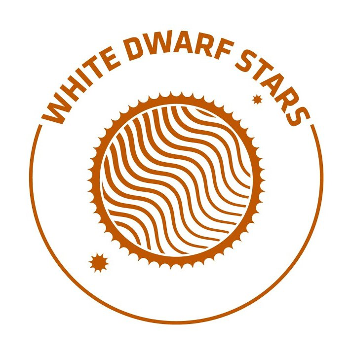

# Examining the Chemical Cartography of the Milky Way Galaxy Using APOGEE and Gaia DR3

(https://fri.cns.utexas.edu/research-streams/white-dwarf-stars)

* Collaborative project with Paige Keating, Urvi Thakurdesai, and Carolina Navarrete at the University of Texas at Austin within the Freshman Research Initiative (FRI) White Dwarf Stars group !
* Translated methods with Gaia DR3 used by Dr. Keith Hawkins at UT Austin (Hawkins 2022, https://doi.org/10.48550/arXiv.2207.04542) to see if chemical mapping with APOGEE could also reveal a spiral structure in the metallicity of the Milky Way Galaxy. 
* Our sample includes the chemical compositions of OBAF-type stars given by APOGEE and their positions within the thin galactic disk given by Gaia DR3.

## Presented Work at UT Austin FRI White Dwarf Stars Group Meeting (November, 2022)

